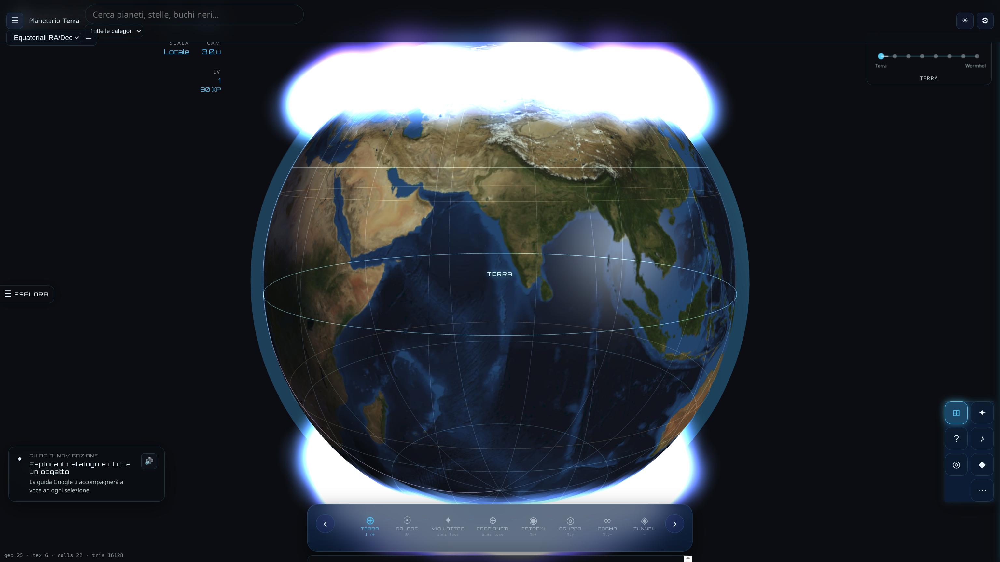

# Planetario 3D — Interstellar Edition

[](https://nodejs.org/)
[](https://vitejs.dev/)
[](https://threejs.org/)
[](https://gsap.com/)
[](https://ai.google.dev/)
[](https://zod.dev/)
[](https://zustand.docs.pmnd.rs/)
[](https://vitest.dev/)
[](CHANGELOG.md)
[]()

Esploratore astronomico 3D interattivo: dalla Terra all'universo osservabile, con assistente Gemini e guida vocale.

## Indice

- [Quick Start](#-quick-start)
- [Panoramica](#-panoramica)
- [Scene e Feature Matrix](#-scene-e-feature-matrix)
- [Installazione e configurazione](#-installazione-e-configurazione)
- [Utilizzo](#-utilizzo)
- [Architettura e documentazione](#-architettura-e-documentazione)

## Quick Start

```bash
git clone <url-repository>
cd planetario && npm install
npm run dev   # → http://127.0.0.1:5174
```

Opzionale — chat e voce Gemini:

```bash
cp .env.example .env   # VITE_GOOGLE_AI_API_KEY=…
```

> **Utente finale:** apri il browser, esplora con mouse o touch, premi `?` per la guida AI.  
> **Sviluppatore:** vedi [Architettura](#-architettura-e-documentazione) e `src/config.ts`.

## Panoramica

Planetario 3D offre **8 scale cosmiche** navigate con transizioni cinematiche, catalogo JSON validato (Zod), pannelli informativi NASA/Wikipedia e qualità grafica adattiva.



> Genera gli screenshot con `npm run dev`, inquadratura scena Terra → salva in `docs/screenshots/`. Vedi [docs/screenshots/README.md](docs/screenshots/README.md).

| Audience | Cosa trovi qui |
|----------|----------------|
| **Utente** | Quick Start, controlli, scene |
| **Sviluppatore** | Feature matrix, struttura `src/`, comandi npm |
| **Contributore** | [CHANGELOG](CHANGELOG.md), [Roadmap](docs/ROADMAP.md), PROMPT_MASTER |

## Scene e Feature Matrix

Legenda: **●** attivo nella scena · **○** non applicabile · **◐** parziale / toggle

| Feature (`FEATURES.*`) | Terra | Solare | Via Lattea | Esopianeti | Estremi | Gruppo | Cosmo | Wormhole |
|------------------------|:-----:|:------:|:----------:|:----------:|:-------:|:------:|:-----:|:--------:|
| `visualThemes` / `scenePalettes` / `glassV22` | ● | ● | ● | ● | ● | ● | ● | ● |
| `compass3d` / `mobileGestures` / `mobileBottomSheet` | ● | ● | ● | ● | ● | ● | ● | ● |
| `gamification` / `geminiVision` / `userProfile` | ● | ● | ● | ● | ● | ● | ● | ● |
| `auroraEffect` | ● | ○ | ○ | ○ | ○ | ○ | ○ | ○ |
| `nebulaRaymarch` / `extendedNebulae` / `dustParticles` | ○ | ○ | ● | ○ | ○ | ○ | ○ | ○ |
| `blackholeLensing` / `extremeObjects` | ○ | ○ | ○ | ○ | ● | ○ | ○ | ○ |
| `exoplanets` | ○ | ○ | ○ | ● | ○ | ○ | ○ | ○ |
| `smallBodies` / `timeSimulation` / `lagrangePoints` / `spaceProbes` | ○ | ● | ○ | ○ | ○ | ○ | ○ | ○ |
| `spacetimeGrid` | ○ | ● | ○ | ○ | ● | ○ | ○ | ○ |
| `darkMatterHalo` | ○ | ○ | ● | ○ | ○ | ● | ● | ○ |
| `largeScaleStructures` | ○ | ○ | ○ | ○ | ○ | ○ | ● | ○ |
| `proceduralPlanets` / `planetAtmospheres` | ◐ | ● | ○ | ○ | ○ | ○ | ○ | ○ |
| `webxr` / `scenePlaylists` / `coordinatesHud` | ● | ● | ● | ● | ● | ● | ● | ● |

### Contenuto per scena

| Scena | Highlight |
|-------|-----------|
| **Terra** | Texture giorno/notte, atmosfera, graticola, aurora |
| **Sistema Solare** | Orbite, corpi minori, Lagrange, sonde, ephemeris |
| **Via Lattea** | Stelle famose, nebulose raymarch, polvere |
| **Esopianeti** | 8 sistemi, zona abitabile, dati JWST |
| **Oggetti Estremi** | Sgr A*, M87*, pulsar; lente gravitazionale |
| **Gruppo Locale** | Andromeda e galassie vicine |
| **Universo Osservabile** | Superammassi, filamenti, CMB |
| **Wormhole** | Tunnel shader, colonna sonora intensa |

Elenco completo flag: `src/config.ts` → `FEATURES`. Storico versioni: [CHANGELOG.md](CHANGELOG.md).

## Installazione e configurazione

**Requisiti:** Node.js ≥ 18, npm. Gemini opzionale ([Google AI Studio](https://aistudio.google.com/apikey)).

| Comando | Descrizione |
|---------|-------------|
| `npm run dev` | Dev server `http://127.0.0.1:5174` |
| `npm run build` | Build produzione → `dist/` |
| `npm run preview` | Anteprima build |
| `npm run typecheck` | Controllo TypeScript |
| `npm run lint` | ESLint |
| `npm run test` | Vitest |
| `npm run convert-assets` | WMA→MP3, icona PWA |
| `node scripts/sync-changelog-links.mjs` | Aggiorna link compare in CHANGELOG da `package.json` |

**`.env`**

| Variabile | Effetto |
|-----------|---------|
| `VITE_GOOGLE_AI_API_KEY` | Chat e TTS Gemini (proxy `/api/gemini` in dev) |
| `VITE_SENTRY_DSN` | Error tracking produzione |
| `VITE_EXPERIMENTAL_WEBGPU=true` | Renderer WebGPU sperimentale |

**Asset custom** (`npm run convert-assets`): `musica/*.wma` → `public/assets/audio/` (`cosmos-main-title.mp3`, `oxygene-part-4.mp3`); `icon/palnetario.png` → `public/icons/`, favicon.

## Utilizzo

### Desktop

| Input | Azione |
|-------|--------|
| Trascina / rotella / tasto destro | Ruota, zoom, pan |
| `←` `→` | Scena precedente / successiva |
| `Ctrl+K` | Ricerca globale |
| `?` | Guida Gemini · `ESC` chiudi pannello |
| `◎` ripristina vista · `♪` musica · `⊞` graticola (Terra) |
| Clic oggetto | Scheda informativa |

### Mobile

Swipe ←→ cambia scena · ↑ pannello oggetto · ↓ chiudi · pinch zoom · doppio tap reset · long press menu.

Problemi comuni → [docs/TROUBLESHOOTING.md](docs/TROUBLESHOOTING.md).

## Architettura e documentazione

```
planetario/
├── public/data/          # Cataloghi JSON
├── src/
│   ├── config/           # Temi visivi, palette
│   ├── core/             # Renderer, post-processing, IBL, KTX2
│   ├── objects/          # Mesh 3D
│   ├── shaders/          # GLSL
│   ├── systems/          # Navigazione, audio, Gemini, ephemeris
│   ├── ui/               # HUD, layout, gesture
│   ├── store/            # Zustand
│   ├── config.ts         # Scene, FEATURES
│   └── app.js            # Orchestrazione
├── tests/                # Vitest
└── docs/                 # Documentazione estesa
```

**Stack:** Vite 8 · Three.js · GSAP · Gemini · Zod · Zustand · Vitest

| Documento | Contenuto |
|-----------|-----------|
| [CHANGELOG.md](CHANGELOG.md) | Storico versioni (Keep a Changelog) |
| [docs/ROADMAP.md](docs/ROADMAP.md) | Fasi di sviluppo e stato |
| [docs/TROUBLESHOOTING.md](docs/TROUBLESHOOTING.md) | Risoluzione problemi |
| [docs/DOCUMENTATION_REFACTOR.md](docs/DOCUMENTATION_REFACTOR.md) | Migrazione documentazione |
| [docs/PROMPT_MASTER_v2.0.md](docs/PROMPT_MASTER_v2.0.md) | Spec contenuti v2.0 |
| [docs/PROMPT_MASTER_v2.1_Supplementare.md](docs/PROMPT_MASTER_v2.1_Supplementare.md) | Spec supplementare v2.1 |

**Licenza:** progetto privato (`"private": true` in `package.json`).
