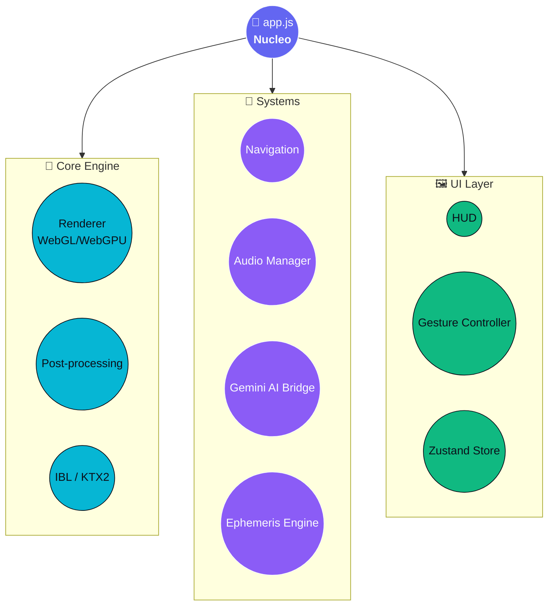
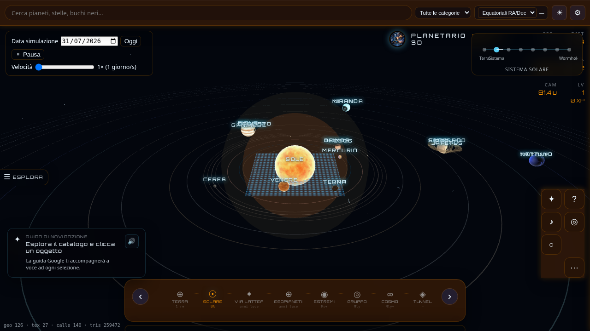
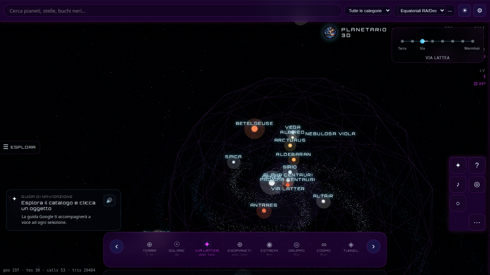
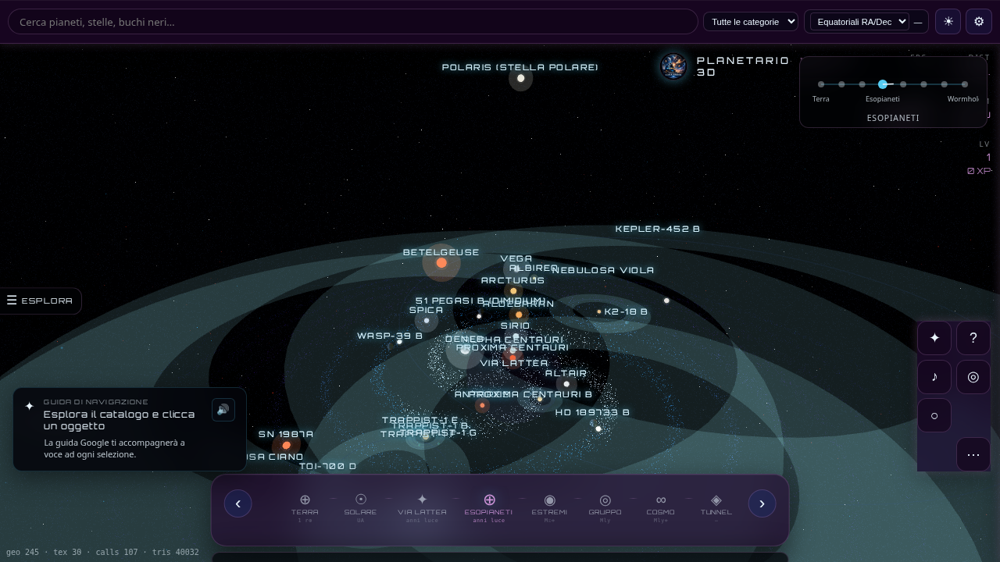
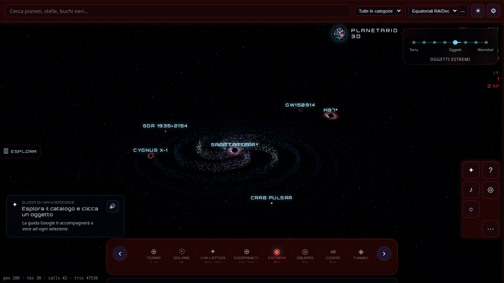
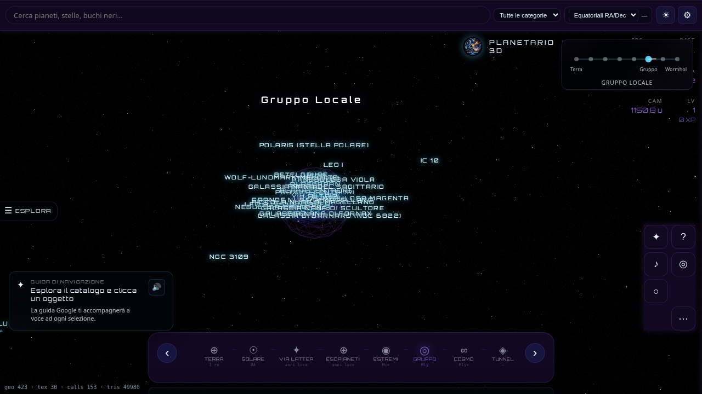
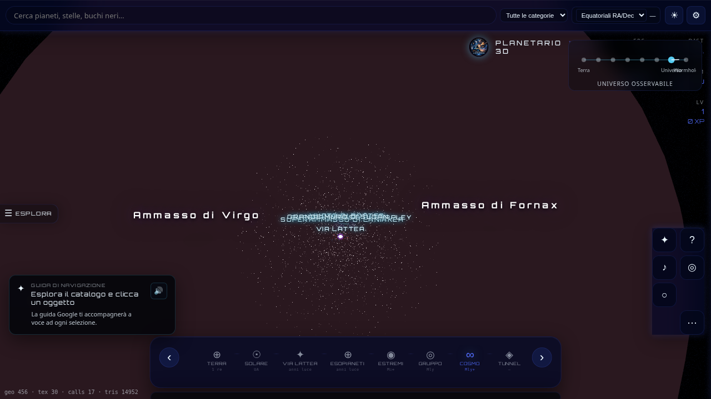
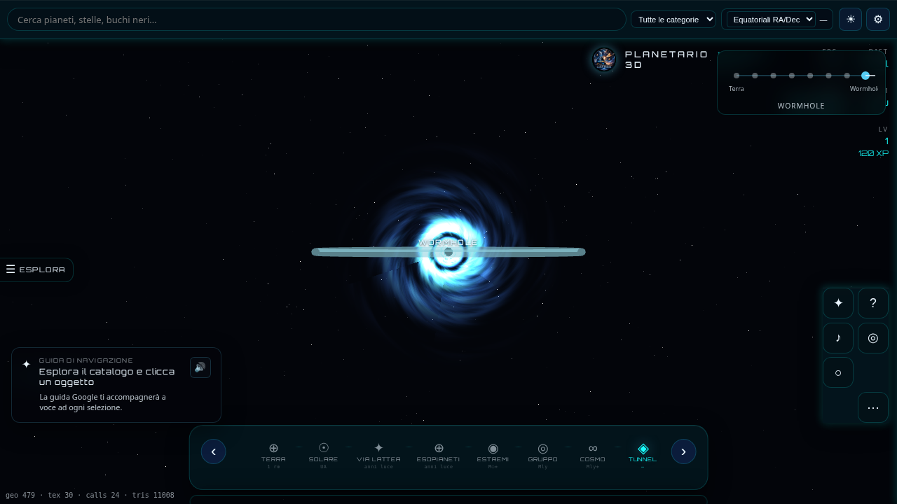

# Planetario 3D — Interstellar Edition

<!-- ═══════════════════ NUCLEO: BADGE DASHBOARD ═══════════════════ -->

<p align="center"><strong>Runtime</strong></p>
<p align="center">
  <a href="https://nodejs.org/"></a>
  &nbsp;
  <a href="https://vitejs.dev/"></a>
</p>

<p align="center"><strong>Engine</strong></p>
<p align="center">
  <a href="https://threejs.org/"></a>
  &nbsp;
  <a href="https://gsap.com/"></a>
  &nbsp;
  
</p>

<p align="center"><strong>Intelligence</strong></p>
<p align="center">
  <a href="https://ai.google.dev/"></a>
  &nbsp;
  <a href="https://zustand.docs.pmnd.rs/"></a>
  &nbsp;
  <a href="https://zod.dev/"></a>
  &nbsp;
  <a href="https://vitest.dev/"></a>
  &nbsp;
  <a href="CHANGELOG.md"></a>
  &nbsp;
  
</p>

<p align="center"><em>Esploratore astronomico 3D interattivo: dalla Terra all'universo osservabile, con assistente Gemini e guida vocale.</em></p>

<!-- ═══════════════════ NUCLEO: HERO & ORBITA NAVIGAZIONE ═══════════════════ -->

<p align="center">
  
</p>

<p align="center">
  <a href="#quick-start-launch-pad"></a>
  &nbsp;&nbsp;&nbsp;
  <a href="#per-sviluppatori"></a>
  &nbsp;&nbsp;&nbsp;
  <a href="#per-contributori"></a>
</p>

<p align="center">✦ · · · · · · · · · · · · · · · · ✦</p>

<a id="indice"></a>

## 📡 Indice

| Orbita | Sezioni |
|--------|---------|
| **👤 Utente** | [Quick Start](#quick-start-launch-pad) · [Utilizzo](#utilizzo) |
| **🛠️ Sviluppatore** | [Installazione](#per-sviluppatori) · [Architettura](#architettura-mermaid) · [Comandi](#command-palette) |
| **🤝 Contributore** | [Scene Cards](#scene-cards--feature-matrix) · [Galleria](#galleria-costellazione) · [Documentazione](#documentazione-estesa) |
| **🌌 Anello esterno** | [Universe Map](#universe-map) · [Licenza](#licenza) |

---

<!-- ═══════════════════ PRIMA ORBITA: UTENTE ═══════════════════ -->

<a id="quick-start-launch-pad"></a>

## 👤 Quick Start — Launch Pad

1️⃣ **Clona e installa**

```bash
git clone https://github.com/thedragon689/planetario.git
cd planetario && npm install
```

2️⃣ **Accensione motori**

```bash
npm run dev   # → http://127.0.0.1:5174
```

3️⃣ **Gemini (opzionale)** — chat e guida vocale

```bash
cp .env.example .env   # imposta VITE_GOOGLE_AI_API_KEY=…
```

> [!TIP]
> **Utente finale:** apri il browser, esplora con mouse o touch, premi `?` per la guida AI. Nessuna configurazione obbligatoria.

> [!IMPORTANT]
> Per chat e TTS Gemini in locale, crea `.env` con `VITE_GOOGLE_AI_API_KEY` da [Google AI Studio](https://aistudio.google.com/apikey). In produzione (Netlify) usa `GOOGLE_AI_API_KEY` lato server — vedi [Installazione](#per-sviluppatori).

> [!NOTE]
> **Sviluppatore:** salta alla [seconda orbita](#per-sviluppatori) per architettura, comandi npm e variabili d'ambiente complete.

<p align="center">✦ · · · · · · · · · · · · · · · · ✦</p>

<a id="utilizzo"></a>

## 🎮 Utilizzo

### 🖥️ Desktop

| Input | Azione |
|-------|--------|
| Trascina / rotella / tasto destro | Ruota, zoom, pan |
| `←` `→` | Scena precedente / successiva |
| `Ctrl+K` | Ricerca globale |
| `?` | Guida Gemini · `ESC` chiude pannello |
| `◎` ripristina vista · `♪` musica · `⊞` graticola (Terra) | Controlli HUD |
| Clic oggetto | Scheda informativa NASA/Wikipedia |

### 📱 Mobile

Swipe ←→ cambia scena · ↑ apre pannello oggetto · ↓ chiude · pinch zoom · doppio tap reset · long press menu contestuale.

> [!TIP]
> L'interfaccia si adatta a smartphone e tablet: bottom sheet, touch target 44px, safe-area per dispositivi con notch. Vedi commit mobile responsiveness in [CHANGELOG.md](CHANGELOG.md).

> [!NOTE]
> Problemi comuni → [docs/TROUBLESHOOTING.md](docs/TROUBLESHOOTING.md)

<p align="right">
  <a href="#indice">⬆️ Torna all'indice</a> &nbsp;|&nbsp;
  <a href="#per-sviluppatori">🛠️ Prossima orbita →</a>
</p>

---

<!-- ═══════════════════ SECONDA ORBITA: SVILUPPATORE ═══════════════════ -->

<a id="per-sviluppatori"></a>

## 🛠️ Per sviluppatori

Planetario 3D offre **8 scale cosmiche** navigate con transizioni cinematiche, catalogo JSON validato (Zod), pannelli informativi NASA/Wikipedia e qualità grafica adattiva.

<p align="center">✦ · · · · · · · · · · · · · · · · ✦</p>

### Installazione e configurazione

**Requisiti:** Node.js ≥ 18, npm. Gemini opzionale ([Google AI Studio](https://aistudio.google.com/apikey)).

**Deploy live:** [planetario3d.netlify.app](https://planetario3d.netlify.app)

#### Variabili d'ambiente

| Variabile | Effetto |
|-----------|---------|
| `VITE_GOOGLE_AI_API_KEY` | Chat e TTS Gemini (dev; proxy `/api/gemini`) |
| `GOOGLE_AI_API_KEY` | Gemini in produzione (Netlify Function, non esposto al browser) |
| `VITE_GEMINI_PROXY=true` | Usa proxy server-side in build produzione |
| `VITE_SENTRY_DSN` | Error tracking produzione |
| `VITE_EXPERIMENTAL_WEBGPU=true` | Renderer WebGPU sperimentale |

> [!WARNING]
> `VITE_EXPERIMENTAL_WEBGPU=true` abilita un renderer sperimentale: post-processing disabilitato, comportamento non garantito su tutti i GPU.

> [!NOTE]
> **Asset custom** (`npm run convert-assets`): `musica/*.wma` → `public/assets/audio/`; `icon/palnetario.png` → `public/icons/`, favicon.

<a id="architettura-mermaid"></a>

### Architettura Mermaid

Sostituisce l'albero ASCII: tre layer orbitali attorno al nucleo `app.js`.



**Stack:** Vite 8 · Three.js 0.184 · GSAP 3.15 · Gemini · Zod 4 · Zustand 5 · Vitest 4

| Layer | Path | Ruolo |
|-------|------|-------|
| Cataloghi | `public/data/` | JSON validati (pianeti, lune, stelle, …) |
| Core | `src/core/` | Renderer, post-processing, IBL, KTX2 |
| Oggetti | `src/objects/` | Mesh 3D, shader, aurora, nebulose |
| Systems | `src/systems/` | Navigazione, audio, Gemini, ephemeris |
| UI | `src/ui/` | HUD, layout responsive, gesture |
| Stato | `src/store/` | Zustand |
| Config | `src/config.ts` | Scene, `FEATURES`, performance |
| Orchestrazione | `src/app.js` | Loop principale, scene assets |
| Test | `tests/` | Vitest |
| Docs | `docs/` | Roadmap, troubleshooting, spec |

<a id="command-palette"></a>

### Command Palette

| Comando | Scopo | Ambiente |
|---------|-------|----------|
| `npm run dev` | Dev server `http://127.0.0.1:5174` |  |
| `npm run build` | Build produzione → `dist/` |  |
| `npm run preview` | Anteprima build locale |  |
| `npm run typecheck` | Controllo TypeScript |  |
| `npm run lint` | ESLint |  |
| `npm run test` | Vitest (19 test) |  |
| `npm run convert-assets` | WMA→MP3, icona PWA |  |
| `node scripts/sync-changelog-links.mjs` | Sync link CHANGELOG |  |

<p align="right">
  <a href="#indice">⬆️ Torna all'indice</a> &nbsp;|&nbsp;
  <a href="#per-contributori">🤝 Prossima orbita →</a>
</p>

---

<!-- ═══════════════════ TERZA ORBITA: CONTRIBUTORE ═══════════════════ -->

<a id="per-contributori"></a>
<a id="scene-cards--feature-matrix"></a>

## 🤝 Per contributori

### Scene Cards — Feature Matrix

Legenda chip: `visualThemes` `glassV22` `mobileGestures` … = attivi in scena · badge **viola** = feature esclusiva o dominante.

> [!NOTE]
> I flag globali UI/AI (prime righe della vecchia matrice) valgono in **tutte** le scene. I flag scena-specifici derivano da `sceneAssets.js`, `app.js` e `FEATURES` in `src/config.ts`.

<details>
<summary><strong>🌍 Terra</strong> &nbsp;  </summary>

| Visivo | Interattivo | Dati |
|--------|-------------|------|
| Texture giorno/notte/specular, atmosfera Rayleigh, graticola, **aurora boreale** | Gesture mobile, bottom sheet, bussola 3D, WebXR | Catalogo Terra, coordinate HUD, Gemini vision |
| `visualThemes` `scenePalettes` `glassV22` `compass3d` | `mobileGestures` `mobileBottomSheet` `gamification` | `coordinatesHud` `geminiVision` `userProfile` |

**Highlight:** unica scena con effetto aurora e graticola geografica.

</details>

<details>
<summary><strong>☀️ Sistema Solare</strong> &nbsp;  </summary>

| Visivo | Interattivo | Dati |
|--------|-------------|------|
| Orbite, pianeti+lune+texture NASA, atmosfere, anelli Saturno, corpi minori | Simulazione temporale, punti Lagrange, sonde spaziali | Ephemeris, catalogo JSON pianeti/lune/probes |
| `planetAtmospheres` `smallBodies` `spacetimeGrid` | `timeSimulation` `lagrangePoints` `spaceProbes` | `scenePlaylists` tutti i flag globali UI/AI |

**Highlight:** Voyager, Juno, Parker; orbite kepleriane e griglia spaziotempo.

</details>

<details>
<summary><strong>🌌 Via Lattea</strong> &nbsp;  </summary>

| Visivo | Interattivo | Dati |
|--------|-------------|------|
| Stelle instanziate, nebulose raymarch volumetriche, polvere cosmica, alone materia oscura | Navigazione galattica, stelle famose cliccabili | Catalogo stelle, nebulose (8 oggetti) |
| `nebulaRaymarch` `extendedNebulae` `dustParticles` `darkMatterHalo` | `instancedStars` `compass3d` | `visualThemes` + tutti i flag globali |

**Highlight:** nebulose procedurali con colori per costellazione; Crab, Orione, Anello.

</details>

<details>
<summary><strong>🔭 Esopianeti</strong> &nbsp;  </summary>

| Visivo | Interattivo | Dati |
|--------|-------------|------|
| 8 sistemi esoplanetari, pianeti procedurali, zona abitabile, nebulose di fondo | Selezione sistemi, confronto dimensioni | Dati JWST/Kepler, catalogo esoplaneti |
| `exoplanets` `proceduralPlanets` `nebulaRaymarch` `extendedNebulae` | `instancedStars` `sizeCompare` | Gemini + pannelli NASA |

**Highlight:** shader procedurali per mondi senza texture; marker cliccabili.

</details>

<details>
<summary><strong>⚫ Oggetti Estremi</strong> &nbsp;  </summary>

| Visivo | Interattivo | Dati |
|--------|-------------|------|
| Sgr A*, M87*, pulsar, lente gravitazionale, griglia spaziotempo | Zoom estremo, effetto lente in tempo reale | Catalogo oggetti estremi |
| `blackholeLensing` `extremeObjects` `spacetimeGrid` | `instancedStars` | Schede Wikipedia + NASA |

**Highlight:** simulazione lente gravitazionale attorno ai buchi neri.

</details>

<details>
<summary><strong>🌠 Gruppo Locale</strong> &nbsp; </summary>

| Visivo | Interattivo | Dati |
|--------|-------------|------|
| Andromeda e galassie vicine, nebulose, polvere, alone materia oscura | Marker galattici, navigazione intergalattica | Catalogo galassie |
| `nebulaRaymarch` `extendedNebulae` `dustParticles` `darkMatterHalo` | `instancedStars` | Tutti i flag globali UI/AI |

**Highlight:** vista di gruppo con strutture a grande scala locali.

</details>

<details>
<summary><strong>🌐 Universo Osservabile</strong> &nbsp; </summary>

| Visivo | Interattivo | Dati |
|--------|-------------|------|
| Superammassi, filamenti cosmici, CMB, alone materia oscura | Scala cosmica estrema, ruler cosmico | Catalogo large-scale |
| `largeScaleStructures` `darkMatterHalo` `instancedStars` | `cosmicRuler` `coordinatesHud` | Dati strutture a grande scala |

**Highlight:** la zoom-out definitiva — filamenti e vuoti cosmici.

</details>

<details>
<summary><strong>🌀 Wormhole</strong> &nbsp; </summary>

| Visivo | Interattivo | Dati |
|--------|-------------|------|
| Tunnel shader iperspaziale, colonna sonora intensa | Transizione cinematografica dedicata | WORMHOLE_DATA in `phenomena.js` |
| Tutti i flag globali UI/AI | `cinemaMode` `relaxMode` | Nessun flag scena-specifico extra |

**Highlight:** esperienza puramente immersiva — nessun catalogo, solo il viaggio.

</details>

Elenco completo flag: `src/config.ts` → `FEATURES`. Storico versioni: [CHANGELOG.md](CHANGELOG.md).

<p align="center">✦ · · · · · · · · · · · · · · · · ✦</p>

<a id="galleria-costellazione"></a>

### Galleria costellazione

Griglia 2×4 — uno screenshot per orbita scenica. Genera con `npm run dev` → vedi [docs/screenshots/README.md](docs/screenshots/README.md).

<p align="center">
  <a href="#scene-cards--feature-matrix"></a>
  <a href="#scene-cards--feature-matrix"></a>
  <a href="#scene-cards--feature-matrix"></a>
  <a href="#scene-cards--feature-matrix"></a>
</p>
<p align="center">
  <strong><code style="color:#06B6D4">Terra</code></strong> &nbsp;·&nbsp;
  <strong><code style="color:#06B6D4">Sistema Solare</code></strong> &nbsp;·&nbsp;
  <strong><code style="color:#06B6D4">Via Lattea</code></strong> &nbsp;·&nbsp;
  <strong><code style="color:#06B6D4">Esopianeti</code></strong>
</p>

<p align="center">
  <a href="#scene-cards--feature-matrix"></a>
  <a href="#scene-cards--feature-matrix"></a>
  <a href="#scene-cards--feature-matrix"></a>
  <a href="#scene-cards--feature-matrix"></a>
</p>
<p align="center">
  <strong><code style="color:#06B6D4">Oggetti Estremi</code></strong> &nbsp;·&nbsp;
  <strong><code style="color:#06B6D4">Gruppo Locale</code></strong> &nbsp;·&nbsp;
  <strong><code style="color:#06B6D4">Universo</code></strong> &nbsp;·&nbsp;
  <strong><code style="color:#06B6D4">Wormhole</code></strong>
</p>

> [!TIP]
> Solo `terra.png` è obbligatorio oggi; gli altri path sono pronti per completare la costellazione visiva.

<a id="documentazione-estesa"></a>

### Documentazione estesa

| Documento | Contenuto |
|-----------|-----------|
| [CHANGELOG.md](CHANGELOG.md) | Storico versioni (Keep a Changelog) |
| [docs/ROADMAP.md](docs/ROADMAP.md) | Fasi di sviluppo e stato |
| [docs/TROUBLESHOOTING.md](docs/TROUBLESHOOTING.md) | Risoluzione problemi |
| [docs/DOCUMENTATION_REFACTOR.md](docs/DOCUMENTATION_REFACTOR.md) | Migrazione documentazione |
| [docs/PROMPT_MASTER_v2.0.md](docs/PROMPT_MASTER_v2.0.md) | Spec contenuti v2.0 |
| [docs/PROMPT_MASTER_v2.1_Supplementare.md](docs/PROMPT_MASTER_v2.1_Supplementare.md) | Spec supplementare v2.1 |

<p align="right">
  <a href="#indice">⬆️ Torna all'indice</a> &nbsp;|&nbsp;
  <a href="#universe-map">🌌 Universe Map →</a>
</p>

---

<!-- ═══════════════════ ANELLO ESTERNO ═══════════════════ -->

<a id="universe-map"></a>

## 🗺️ Universe Map

Il viaggio completo attraverso le 8 orbite cosmiche:

```
🌍 Terra → ☀️ Sistema Solare → 🌌 Via Lattea → 🔭 Esopianeti → ⚫ Oggetti Estremi → 🌠 Gruppo Locale → 🌐 Universo → 🌀 Wormhole
```

| # | Scena | Chiave | Lente gravitazionale |
|---|-------|--------|----------------------|
| 1 | Terra | `earth` | Superficie, aurora, graticola |
| 2 | Sistema Solare | `solar_system` | Orbite, sonde, ephemeris |
| 3 | Via Lattea | `milky_way` | Nebulose raymarch, stelle |
| 4 | Esopianeti | `exoplanets` | Mondi procedurali, JWST |
| 5 | Oggetti Estremi | `extreme` | Buchi neri, lente gravitazionale |
| 6 | Gruppo Locale | `local_group` | Andromeda, galassie vicine |
| 7 | Universo Osservabile | `observable` | Filamenti, CMB, superammassi |
| 8 | Wormhole | `wormhole` | Tunnel iperspaziale |

<p align="center">✦ · · · · · · · · · · · · · · · · ✦</p>

<a id="licenza"></a>

## 📜 Licenza

> [!CAUTION]
> Progetto **privato** (`"private": true` in `package.json`). Non distribuire senza autorizzazione del titolare.

---

<p align="center">
  <a href="CHANGELOG.md"></a>
  &nbsp;
  <a href="docs/ROADMAP.md"></a>
  &nbsp;
  <a href="https://planetario3d.netlify.app"></a>
</p>

<p align="center"><sub>Planetario 3D Interstellar Edition · v2.2.0 · Nucleo <code>app.js</code> · 8 orbite · ∞ orizzonti</sub></p>
